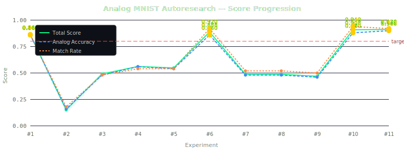

# Analog MNIST — Autoresearch Results

> A resistive crossbar circuit that classifies handwritten digits through pure analog physics.
> No CPU. No GPU. No code execution during inference. Just Ohm's law and Kirchhoff's law.

**Best Score: 0.9122** (experiment #11)
| Latest Score: 0.9122 | Experiments: 11 |

## Score Progression



## The Challenge

| Constraint | Value |
|-----------|-------|
| Input | 14×14 MNIST digits (196 pixels) |
| Architecture | 196 → 64 (ReLU) → 10 |
| Resistors | ~26,000 (differential crossbar) |
| Diode model | **Realistic** (n=1.0, Is=1e-14) — 0.7V forward drop |
| Resistor mismatch | **5% random variation** on every resistor |
| Target | ≥ 80% analog accuracy on 100 test digits |

## Experiment History

| # | Score | Analog Acc | Match | CosSim | Notes |
|---|-------|-----------|-------|--------|-------|
| 1 | **0.8641** ⭐ | 86.0% | 86.0% | 0.9012 | baseline: hard mode (n=1.0, 5% mismatch) |
| 2 | **0.1500** | 16.0% | 18.0% | -0.1591 | auto-experiment 1 |
| 3 | **0.4911** | 48.0% | 48.0% | 0.5913 | auto-experiment 2 |
| 4 | **0.5613** | 56.0% | 54.0% | 0.6327 | auto-experiment 3 |
| 5 | **0.5484** | 54.0% | 54.0% | 0.6238 | auto-experiment 4 |
| 6 | **0.8877** ⭐ | 86.0% | 92.0% | 0.9570 | auto-experiment 5 |
| 7 | **0.4869** | 48.0% | 52.0% | 0.4291 | auto-experiment 1 |
| 8 | **0.4875** | 48.0% | 52.0% | 0.4352 | auto-experiment 2 |
| 9 | **0.4689** | 46.0% | 50.0% | 0.4289 | auto-experiment 3 |
| 10 | **0.9084** ⭐ | 88.0% | 94.0% | 0.9839 | auto-experiment 4 |
| 11 | **0.9122** ⭐ | 90.0% | 92.0% | 0.9621 | auto-experiment 5 |

## Best Parameters

```json
{
  "diode_n": 1.0,
  "mismatch_pct": 5.0,
  "mismatch_seed": 42,
  "G_scale": 0.0005654383709377929,
  "diode_is": 1.3165192673102367e-14,
  "R_tia": 5304.286023943623,
  "R_pulldown": 245598.52788772713,
  "V_high": 0.7000127996825809,
  "reltol": 0.0007205520816989119
}
```

---
*Auto-generated by `update_results.py`. Each experiment runs real ngspice simulations.*
